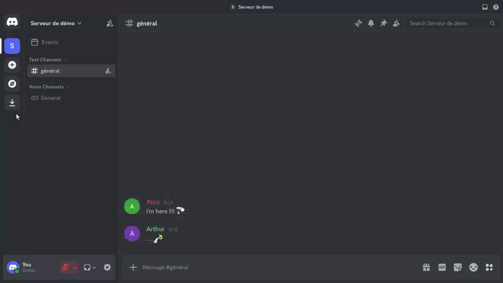

# Show channel emotes

The `/gimme emoji` command asks the bot to collect recent custom emotes from the
channel.

## Preview

## Usage

1. Type `/gimme emoji` in a text channel.
2. Send the command.

The bot looks at the last messages in the channel, picks up the custom emotes
used there, and replies with a gallery of what it found.

## Other variants

`/gimme` offers other subcommands depending on the content available on the bot
(otter, images, and so on).

Playback file: [`gimme-emoji.json`](gimme-emoji.json)
