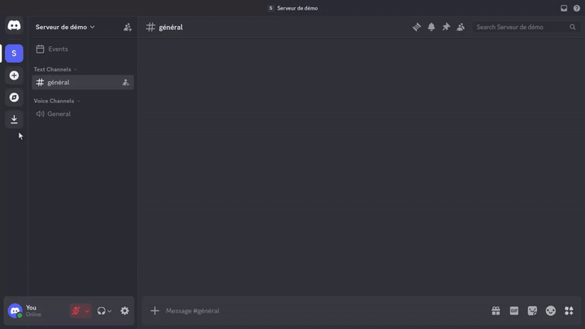

# Show an otter

The `/gimme otter` command asks the bot to display an otter image.

## Preview

## Usage

1. Type `/gimme otter` in a text channel.
2. Send the command.

The bot replies with an image it found for you.

## Other variants

`/gimme` offers other subcommands depending on the content available on the bot (emoji, images, and so on).

Playback file: [`gimme-otter.json`](gimme-otter.json)
