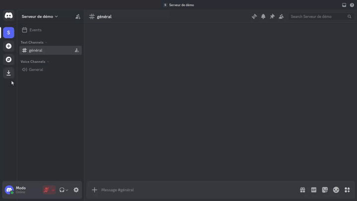

# Create a poll

Moderators can create a poll directly from Discord with `/poll create`.

## Preview

## Usage

1. Type `/poll create` in a text channel.
2. Fill in the form:
   - **Poll title** — name shown to members
   - **Voters role** _(optional)_ — restricts voting to a role
   - **Poll question** — the question being asked
   - **Description** _(optional)_ — context for voters
3. Submit the modal.

The bot replies with an ephemeral message showing a poll preview and three actions:

| Button       | Effect                        |
| ------------ | ----------------------------- |
| Add choices  | Adds answer options           |
| New question | Adds a question to the poll   |
| Publish poll | Posts the poll in the channel |

## After publishing

The poll appears in the channel with a **I vote!** button to vote and **Summary** to view results.

Playback file: [`poll-moderator-flow.json`](poll-moderator-flow.json)
